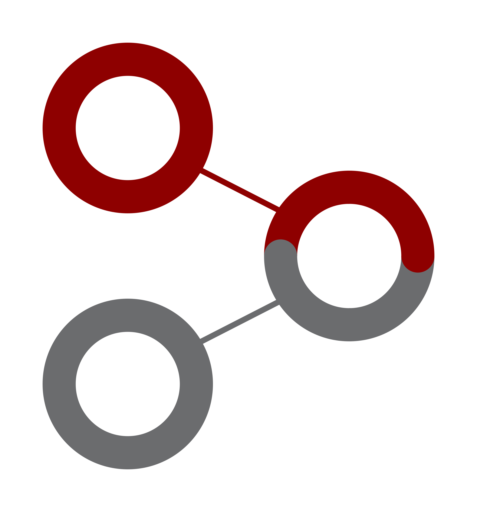

# Examples learning



This project aims to find similarities in a set of formatted data and propose one or more characteristic(s) description(s) that carry the most information.

<!-- A presentation of the project is [available here](http://gaelfoppolo.github.io/examples-learning/slides/).* -->

## Project

The application is based on the concept of model, examples (and counter-examples), objects, attributes and relations:

 - A **model** is the definition of the formatted data on which the program works. This is where the attribute(s) and the relation(s), that describe it, are defined. (*ex: a geometric shape, described by its shape, color and size*)
 - An **object** is an instantiation of the model (*ex: a square, red of size 8*)
 - An **example** (or counter-example) is a set of objects. Each example is independant of the others.
 - An **attribute** describes an aspect of an object and can be of three type:
	 - numerical, an integer interval (*ex: a size*)
	 - discrete, an enumeration (*ex: a color*)
	 - hierarchical, a tree (*ex: a shape*)
 - A **relation** describes a directionnal connection between two objects in the same example (*ex: A is next-to B*)

This project is part of an enginnering school programming project, here the original [subject](https://github.com/gaelfoppolo/examples-learning/blob/master/subject.pdf) (french).

A [documentation](http://gaelfoppolo.github.io/examples-learning/) is also available, with graph to a better understanding of our process (see [Files](http://gaelfoppolo.github.io/examples-learning/files.html) tabs).

## How to populate input files

The programs use two different types of file to generate the solutions of a problem. These files are located in the *ressources* directory.

### Model

The information on the **model** (ie: the definition of the object's attributes, the possible relations, the bounds of the values, etc...) is defined in a file with the *cfg* extension. It follows this syntax:
```
attribute-name : attribute-value
relation : relation-name[, relation-name]
# each value can be of one of the three following types:
# integer, in interval, defined like this:
integer-attribute : <min> - <max>
# an enumeration item, from an enumeration, defined like this:
enum-attribute : <item> [, <item>]
# a tree node, from a tree, defined like this:
tree-attribute : (<node-name>, (<child-name>[, ...]), (<child-name>))
# a tree definition can be split on more than one line to allow a greater readability

# to define the possible relations between the objects, you must use the 'relation' keyword
relation: relation-name[, relation-name]
```
See [config-commented.cfg](https://github.com/gaelfoppolo/examples-learning/blob/master/ressources/config-commented.cfg) for further explanations.

### Examples

The **model** defines the rules behind the **examples**, which are defined in a file with the *exp* extension. It follows this syntax:
```
include <path-to-model-file>

Example-name
	object-name:attribute-name(attribute-value)[, attribute-name(attribute-value)][,relation-name(object-linked-name)]
	[...]
!Counter-example-name
	# same syntax as of the examples
```
See [examples-commented.exp](https://github.com/gaelfoppolo/examples-learning/blob/master/ressources/examples-commented.exp) for further explanations.

## Usage and options

Compile with ``make`` or ``make learning``.

See [makefile](https://github.com/gaelfoppolo/examples-learning/blob/master/makefile) for further explanations.

To run the program only need the path to the example file as a parameter:
``learning <path-to-example-file> [options]``

It accept some options:

- ``--help`` or ``-h``
Print some help on basic options

- ``--expand-relations``
When the solution have relations, print the whole object linked instead of its name

- ``--no-generalization``
Skip the generalization step (print all the solutions, even duplicates and non-important solutions)

- ``--no-counter-examples``
Skip the counter-examples handling. Prevent the suppression of solutions, even if they match the counter-examples in the example file

- ``--no-color``
Remove all colors from the output

- ``-v``
Verbosity level, you can use up to 4 `v` to add information